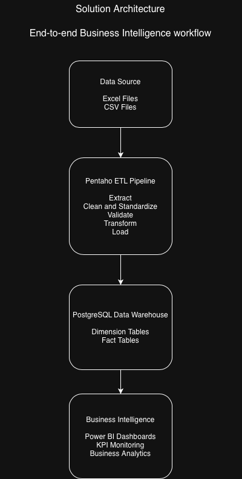

# Customer Experience Analytics Solution

**From fragmented operational data to actionable business insights.**

An end-to-end Business Intelligence solution that centralizes customer satisfaction surveys and operational incident data into a dimensional data warehouse, enabling reliable analytics and interactive decision-making dashboards.

> **Confidentiality Notice**
>
> This repository presents a real-world Business Intelligence case study developed for the customer experience area of a financial institution. To respect confidentiality and intellectual property, proprietary datasets, ETL workflows, SQL scripts, and Power BI files are intentionally omitted. The focus of this repository is to showcase the solution architecture, technical design decisions, and engineering approach.

## Overview

This project presents an end-to-end Business Intelligence solution designed to transform fragmented operational data into reliable business insights.

The solution consolidates customer satisfaction surveys and operational incident records from multiple data sources into a centralized PostgreSQL data warehouse through automated ETL pipelines developed with Pentaho Data Integration. The resulting analytical model powers interactive Power BI dashboards that support KPI monitoring and data-driven decision making.

The project follows a modern Business Intelligence architecture, covering the complete analytics lifecycle—from data integration and dimensional modeling to business reporting and visualization.

## Business Problem

Customer experience data was distributed across multiple operational spreadsheets generated by different service channels. This fragmented approach made it difficult to maintain data consistency, monitor service quality, identify operational trends, and calculate key performance indicators.

Without a centralized analytical repository, reporting processes were largely manual, limiting the organization's ability to obtain timely and reliable insights for decision making.

The objective of this project was to design a Business Intelligence solution capable of integrating heterogeneous data sources, organizing information within a dimensional data warehouse, and delivering interactive dashboards that support operational and strategic analysis.

**Project Goal**

Design and implement an end-to-end Business Intelligence solution capable of integrating operational data, ensuring data quality, and delivering actionable insights through dimensional modeling and interactive dashboards.

## Solution Architecture

The solution follows a layered Business Intelligence architecture that separates data ingestion, transformation, storage, and visualization into independent components.

This design improves data quality, simplifies maintenance, and provides a reliable foundation for business reporting and analytics.

  

|      Layer         |                                    Purpose                                         |
|     --------       |                                   ---------                                        |
| **Data Sources**   | Collect customer surveys and operational incident data from multiple files.        |
| **ETL**            | Extract, clean, validate, standardize, and transform data using Pentaho Data Integration.   |
| **Data Warehouse** | Store integrated data in a PostgreSQL dimensional model optimized for analytics. |
| **Business Intelligence** | Deliver interactive dashboards and KPIs through Power BI. |
